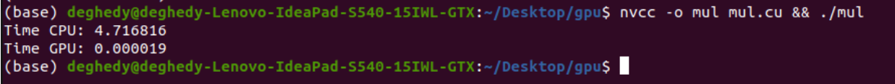

# Analyzing-performance-of-CUDA-matrix-operations

### CUDA Matrix Operations

This project provides an implementation of matrix operations using CUDA to accelerate performance on compatible GPUs.

### Features

- Accelerated matrix operations using CUDA
- Support for both matrix addition and multiplication
- Benchmarking performance for both CPU and GPU.

### Requirements

- NVIDIA GPU with CUDA support
- CUDA toolkit installed

### Comparison

Time Difference between GPU and CPU Computation Time (With N = 1000).




### Usage

Example usage:

```bash
nvcc -o main main.cu && ./main
```
